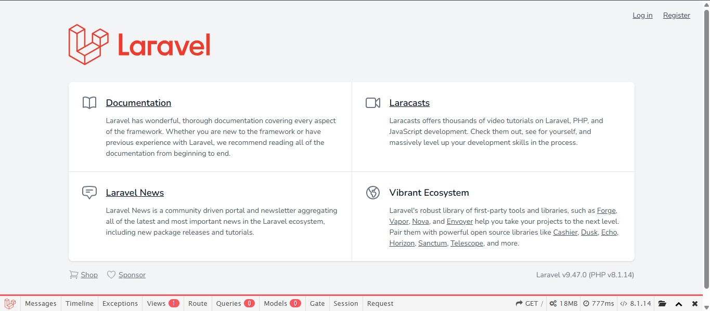
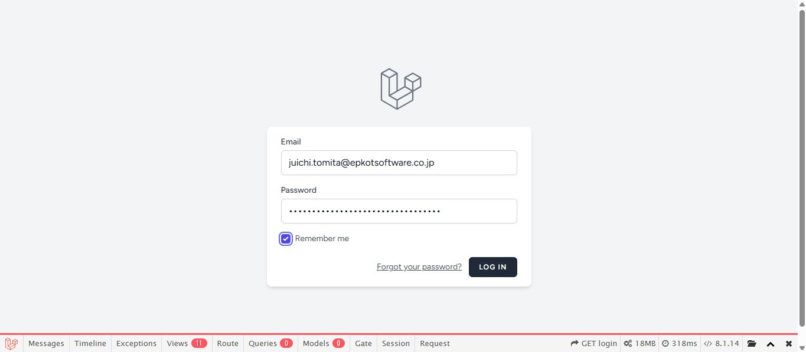
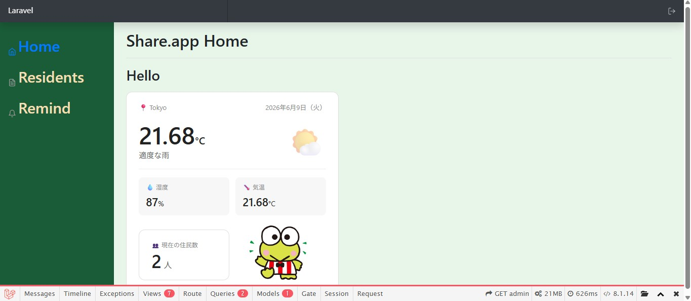
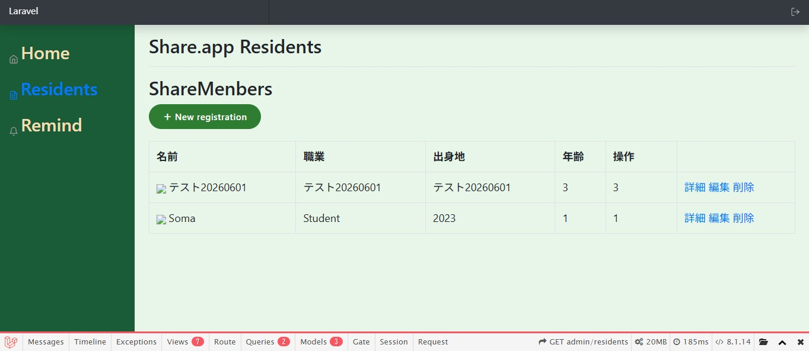
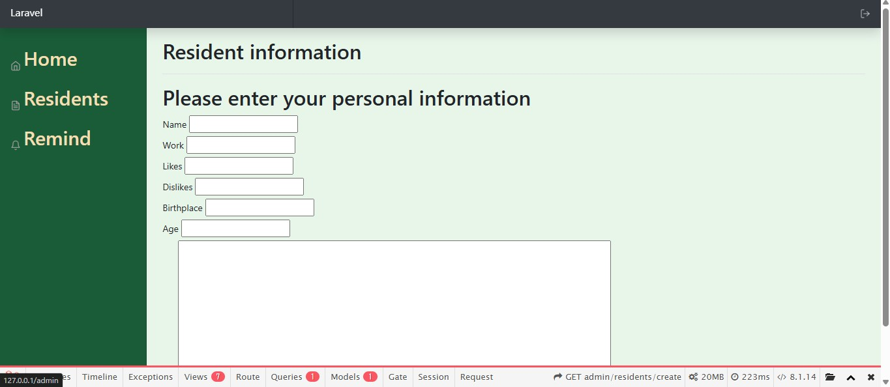
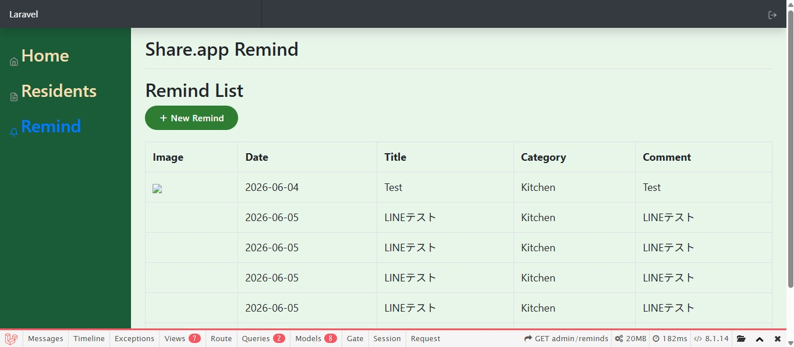
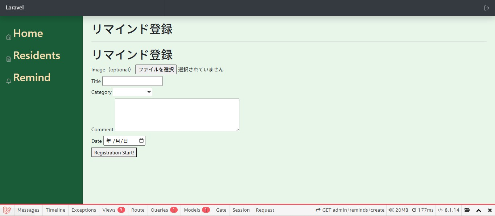

# Share.app — シェアハウス住民向け管理Webアプリ

## アプリ概要

国際交流シェアハウスの住民が、互いのプロフィールを把握してコミュニケーションのきっかけをつかんだり、ハウス内のリマインドを共有・管理したりするためのWebアプリ。

**主な目的**
- 住民同士の会話のきっかけをつくる
- 住民の心理的安全性を高める
- リマインド内容をデータとして管理する

**想定ユーザー**
- 国際交流型・50人規模のシェアハウスに住む20〜40代の住民
- 多様なバックグラウンドを持つ人々と円滑にコミュニケーションを取りたい人

---

## 技術スタック

| 項目 | 内容 |
|------|------|
| バックエンド | PHP / Laravel 9 |
| フロントエンド | Blade / CSS |
| データベース | MySQL |
| インフラ | Docker（Ubuntu環境） |
| 外部API | OpenWeatherMap API、LINE Messaging API |
| 認証 | Laravel Breeze |

---

## 実装済み機能

### Resident（住民管理）ページ
- 住民情報の登録・一覧表示・詳細表示・削除
- プロフィール画像のアップロード

### Home ページ
- 当日の天気表示（OpenWeatherMap API連携）

### Remind ページ
- リマインドの投稿・一覧表示
- 一定量同じカテゴリのリマインドが溜まればLINEへの通知機能

### 共通
- ログイン・認証機能

---

## 工夫したポイント

- **フールプルーフ設計**：削除ボタンに確認ダイアログを実装し、誤操作を防止。削除ボタンは赤色で視覚的にも区別
- **クロスブラウザ対応**：ブラウザごとのデフォルトCSSによる表示差異をリセットし、統一したUIを実現
- **パフォーマンス**：開発する際Dockerプロジェクトの配置をWindowsからUbuntu環境に移行し、動作速度を改善

---

## 画面イメージ

## 今後の対応予定

### 優先度：高
- [ ] ER図の作成・追記
- [ ] 現住民と退去住民のグループ化機能
- [ ] リマインドの月別グループ化機能
- [ ] 物理削除ダイアログのJS実装

### 優先度：中
- [ ] 各画面（Home・住民一覧・住民詳細・Remind）のUI改善
- [ ] 住民詳細画面の画像表示をよりリッチに（JSアニメーション等）

### 優先度：低
- [ ] ページネーション（大量データ対応）
- [ ] AWSへのデプロイ
- [ ] PHPUnit によるテストの追加